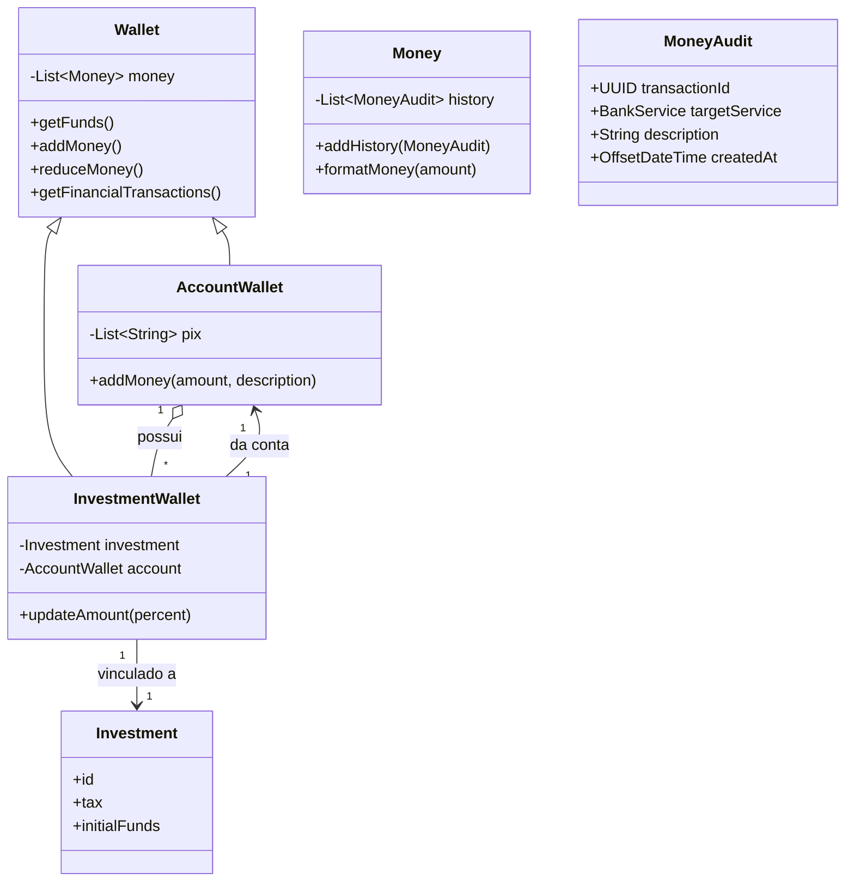

# 🏦 Projeto  de Banco Simples em Java (java-bank)


Este é um projeto didático desenvolvido em **Java** para consolidar conceitos de **Programação Orientada a Objetos (POO)**.  
O aplicativo simula um sistema bancário simples via **linha de comando**, permitindo operações em **Conta Corrente** e **Conta Investimento**, com histórico de transações.

--- 

## 🚀 Estrutura do Projeto
```
br.com.dio
├─ model
│ ├─ AccountWallet.java
│ ├─ Investment.java
│ ├─ InvestmentWallet.java
│ ├─ Money.java
│ ├─ MoneyAudit.java
│ ├─ Wallet.java
│ └─ BankService.java
├─ repository
│ ├─ AccountRepository.java
│ ├─ InvestmentRepository.java
│ └─ CommonsRepository.java
├─ exception
│ ├─ AccountNotFoundException.java
│ ├─ AccountWithInvestmentException.java
│ ├─ PixInUseException.java
│ ├─ WalletNotFoundException.java
│ └─ NoFundsEnoughException.java
└─ Main.java
```

## 🚀Diagrama do Projeto


## 🚀 Funcionalidades
- 🏦 Criar contas com múltiplas chaves Pix
- 📈 Criar investimentos com taxa de rendimento e valor inicial
- 💵 Depósitos e saques em contas
- 🔁 Transferência entre contas via Pix
- 💹 Investir valores de contas em investimentos
- 💰 Resgatar valores de investimentos
- 🔄 Atualizar rendimentos dos investimentos (simulação manual)
- 📄 Consultar extrato/histórico financeiro de uma conta

---

## 🛠 Tecnologias

- Java 17 ou superior
- [Lombok](https://projectlombok.org/) para simplificação de getters, toString e equals/hashCode

---

## 🛠️ Conceitos aplicados

- Abstração, herança e polimorfismo
- Encapsulamento e composição
- Uso de coleções (`List`, `Map`) para contas e transações
- Controle de fluxo e tratamento de erros
- Interação com usuário via linha de comando (`Scanner`)

---

## Exemplo de uso (menu)
 1. Criar uma conta
 2. Criar um investimento
 3. Fazer um investimento
 4. Depositar na conta
 5. Sacar da comta
 6. Transferência entre contas
 7. Investir
 8. Sacar investimento
 9. Listar contas
10. Listar investimentos
11. Listar carteiras de investimento
12. Atualizar investimentos
13. Histórico de conta
14. Sair

**Selecione a operação desejada:** 

---

## 💡 Observações

* Todos os valores são manipulados em centavos internamente.
* Não há persistência: ao fechar o programa, todas as informações são perdidas.
* Operações como atualização de rendimentos são manuais, via menu.

---
